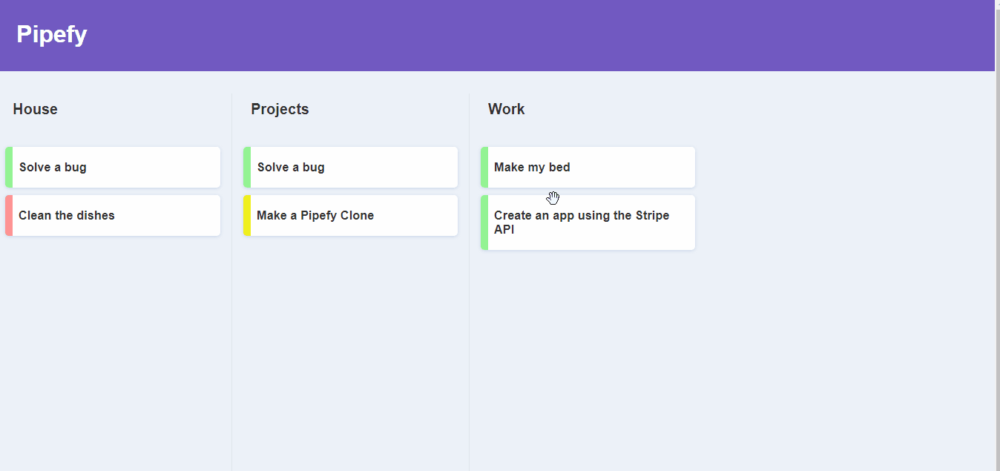

#  About :rocket:

A Pipefy interface clone. The app's main purpose is recreate the drag and drop functionality, which was made with React DnD. Used styled-components for styling.



#  Installation :computer:
Make sure your have Node.js installed on your computer.

Clone the repo:

git clone https://github.com/Gabriel2233/Pipefy-Drag-and-Drop.git

After entering inside the project directory, start the project:

```bash
yarn

//or

npm install
```

```bash
yarn start 

//or

npm start
```

That's it!

##  Contributing :facepunch:
Pull requests are welcome. For major changes, please open an issue first to discuss what you would like to change.
